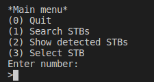
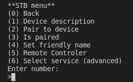

# upnpSearcher
Discover and comunicate with STBs on local network using UPnP protocol.

## Features

*   Discover STBs on local network
*   Show discovered STBs
*   Select a specific STB
*   Show STB description
*   Pair to STB
*   Set STB friendly name
*   Send remote key command
*   Manually select service and action to send
*   Show services, actions and action arguments

## Platform

* Linux

## Dependency

[SocketLib](https://github.com/trajko-code/socketLib) is library for working with POSIX sockets.

## Build Requirements

*  [CMake](https://cmake.org/) minimum version 3.18

*  A C++11-standard-compliant compiler

## Build Application

**RECOMMENDED:** Before build application change friendly name and aplicationID in include/Config.hpp.

```cpp
namespace Config
{ 
    static std::string friendlyName = "upnpSearcher";
    static std::string aplicationID = "1234";
}
```

You can easily build application by running **run-build.sh** shell script with following command:
```shell
sh ./run-build.sh
```

## Example of use

After starting the application the main manu is displayed: 

|

After searching devices on local network (option 1), you can select one of descovered set-top box
(option 3) and STB menu will be displayed.

|


* **option 1** shows device description like uuid, friendly name, address, port, manufacturer...
* **option 2** sends request for pairing with device and ask you to enter PIN that will be show on TV screen
* **option 3** checks if device is paired
* **option 4** change device friendly name 
* **option 5** lists key codes and ask you to enter key code for remote controler
* **option 6** allows user to manually select service and service action that will be send to device 
